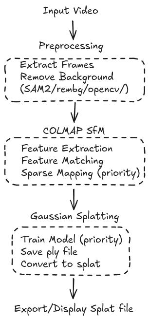
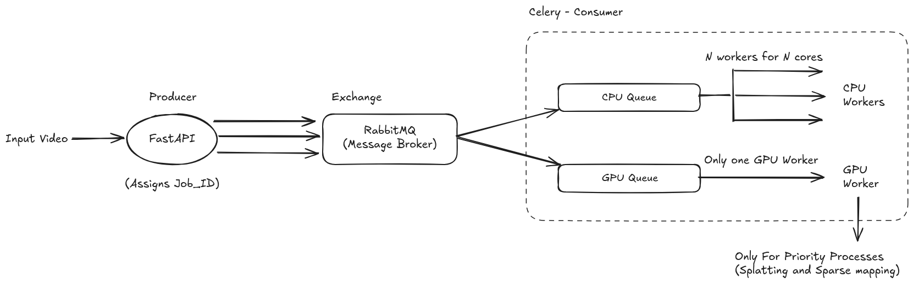

# splatgen
Reconstruct scenes/objects from Videos using Gaussian Splatting

## **Requirements**:
- Docker (nvidia-container-toolkit, docker-compose)
- CUDA Enabled GPU
- NVIDIA Container Toolkit >= 11.8


> [!NOTE]
> The current configuration works for a single GPU of 7.5/8.6/8.9 CUDA Compute Capability, which covers most GeForce/RTX GPUs.

<details>

<summary>For other GPUs</summary>

<br>

Get your Compute Capability with this command:
```bash
nvidia-smi --query-gpu=compute_cap --format=csv
```
Or find it on the NVIDIA Website [here](https://developer.nvidia.com/cuda-gpus).


Then set the `TORCH_CUDA_ARCH_LIST` variable in `worker/Dockerfile` to the Compute Capability of your GPU (e.g. 8.7, 8.9, 12.0).

</details>

## **Setup**:

```bash
git clone https://github.com/udqy/splatgen
cd splatgen
docker compose build
docker compose up
```

If you want to use more than one GPUs:
```bash
NUM_GPUS=$(nvidia-smi --query-gpu=count --format=csv,noheader)
docker-compose up --build --scale gpu_worker=$NUM_GPUS -d
```

## **Stack**:
*   **Web Framework:** **FastAPI** (for handling HTTP requests, located in `interface/`)
*   **Database:** **PostgreSQL** + **SQLAlchemy** + **`asyncpg`** (for storing job status and metadata)
*   **Task Queue:** **Celery** (for defining, managing, and executing background tasks, located in `worker/`)
*   **Message Broker:** **RabbitMQ** (mediates communication between FastAPI and Celery workers)
*   **Containerization:** **Docker** & **Docker Compose** (for environment definition, build, orchestration, and configuration)


## **Architecture**:

<details>
<summary>High-Level architecture</summary>



</details>

<details>
<summary>Stack Overview</summary>



</details>

## **Directory Structure**:

```bash
splatgen/
├── docker-compose.yml      # for orchestration - ties in fastapi + celery + rabbitmq
├── .env
├── .gitignore
├── .dockerignore
│
├── interface/              # fastapi app
│   ├── Dockerfile
│   ├── requirements.txt
│   ├── app/
│   ├── static/             # For CSS and JS files
│   │   ├── css/
│   │   │   └── style.css
│   │   └── js/
│   │       └── script.js
│   └── templates/          # For HTML files
│       ├── upload.html
│       ├── list_splats.html
│       └── view_splat.html
│
├── worker/                 # celery worker with queues
│   ├── Dockerfile
│   ├── requirements.txt
│   ├── celery_app.py
│   └── tasks/              # all pipelined tasks
│
└── data/              # Mounted volume for persistent I/O
    └── <job_id_1>/
    └── <job_id_2>/
```
